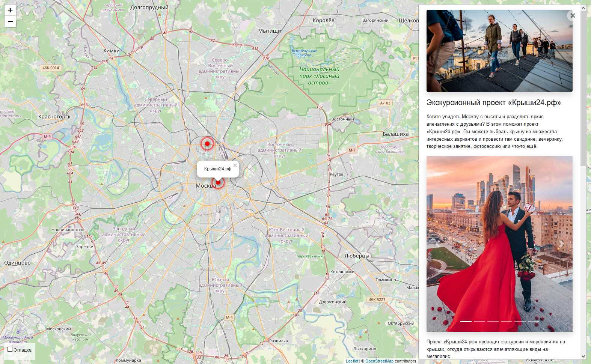

# Сайт Афиша-Москва

Сайт о самых интересных местах в Москвы.



[Пример работы](#)

### Как установить

1. Python3 должен быть уже установлен

2. Рекомендуется использовать [virtualenv/venv](https://docs.python.org/3/library/venv.html) для изоляции проекта

3. Используйте `pip` (или `pip3`, есть конфликт с Python2) для установки зависимостей:
    ```
    pip install -r requirements.txt
    ```

4. Сгенирируте пароль проекта и поместите его в файл `.env` под именем `SECRET_KEY`

5. Для отладки в `.env` положите переменную `DEBUG` со значением `True`

6. Запустите миграции базы данных командой:
    ```
    python3 manage.py migrate
    ```

7. Запустите сайт командой:
    ```
    python3 manage.py runserver
    ```

8. Откройте сайта в бразуере: `http://127.0.0.1:8000/`

### Наполнение и менеджмент базы данных

Вход в базу данных (админка сайта):

1. Создайте суперюзера (обладает всеми правами) командой:
    ```
    python3 manage.py createsuperuser
    ```

2. Перейдтие в админку по адресу: `http://127.0.0.1:8000/admin/` и авторизуйтесь с данными из первого шага.

Данные о локациях лежат в двух моделях:

1. Places — подробные данные о месте (заголовок, короткое и полное описания, координаты и изображения). Отображаются при выборе (по клику) локации на карте. Изображения лежат в отдельной модели, но для удобства отображаются здесь, их порядок можно менять перетаскиванием.

2. Locations — данные локации (название, идентификатор, ссылка на подробные данные, координаты). Название появляется при наведении мыши на точку. Координаты задают точку на карте. Идентификатор должен быть уникален для каждой локации.


### Цель проекта

Код написан в образовательных целях на онлайн-курсе для веб-разработчиков [dvmn.org](https://dvmn.org/).
