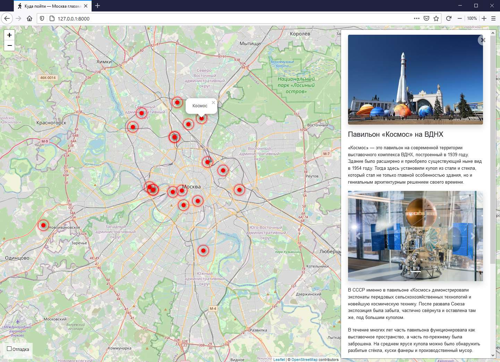

# Сайт Афиша-Москва

Сайт о самых интересных местах в Москве.



[Пример работы](http://wheretogofaholo.pythonanywhere.com/)

### Как установить

1. Python3 должен быть уже установлен

2. Рекомендуется использовать [virtualenv/venv](https://docs.python.org/3/library/venv.html) для изоляции проекта

3. Используйте `pip` (или `pip3`, есть конфликт с Python2) для установки зависимостей:
    ```
    pip install -r requirements.txt
    ```

4. Сгенерируйте пароль проекта и поместите его в файл `.env` под именем `SECRET_KEY`

5. Для отладки в `.env` положите переменную `DEBUG` со значением `True`

6. Запустите миграции базы данных командой:
    ```
    python3 manage.py migrate
    ```

7. Запустите сайт командой:
    ```
    python3 manage.py runserver
    ```

8. Откройте сайт в браузере: [http://127.0.0.1:8000/](http://127.0.0.1:8000/)

### Настройки

Внизу справа на странице можно включить отладочный режим логгирования.


Настройки сохраняются в Local Storage браузера и не пропадают после обновления страницы. Чтобы сбросить настройки удалите ключи из Local Storage с помощью Chrome Dev Tools —&gt; Вкладка Application —&gt; Local Storage.

Если что-то работает не так, как ожидалось, то начните с включения отладочного режима логгирования.

### Наполнение и менеджмент базы данных

Вход в базу данных (админка сайта):

1. Создайте суперюзера (обладает всеми правами) командой:
    ```
    python3 manage.py createsuperuser
    ```

2. Перейдите в админку по адресу [http://127.0.0.1:8000/admin/](http://127.0.0.1:8000/admin/) и авторизуйтесь с данными из первого шага.

Данные о локациях лежат в модели Places с полями:

* Заголовок
* Короткий заголовок для отображения на карте
* Уникальный идентификатор локации
* Короткое описание
* Полное описание
* Координаты (широта и долгота)
* Изображения (лежат в отдельной модели Images, но для удобства отображаются здесь, их порядок можно менять перетаскиванием)

Для быстрого наполения базы данных воспользуйтесь менеджмент командой `load_place`, аргументом для которой служит список ссылок на json-файлы с данными о месте:
```
python3 manage.py load_place http://first/url/to/file.json http://second/url/to/file.json
```
[Пример файла](examples/place.json)

### Цель проекта

Код написан в образовательных целях на онлайн-курсе для веб-разработчиков [dvmn.org](https://dvmn.org/).

Все данные о локациях взяты с сайта [KudaGo](https://kudago.com).
